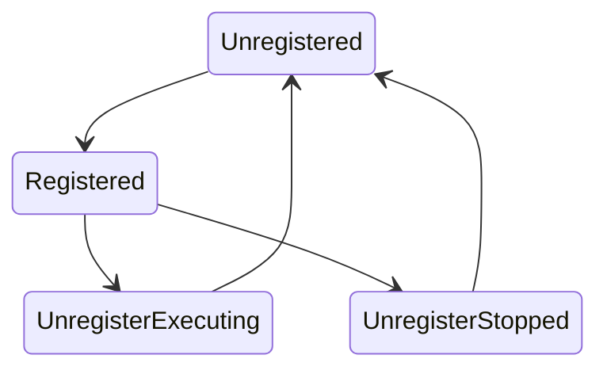
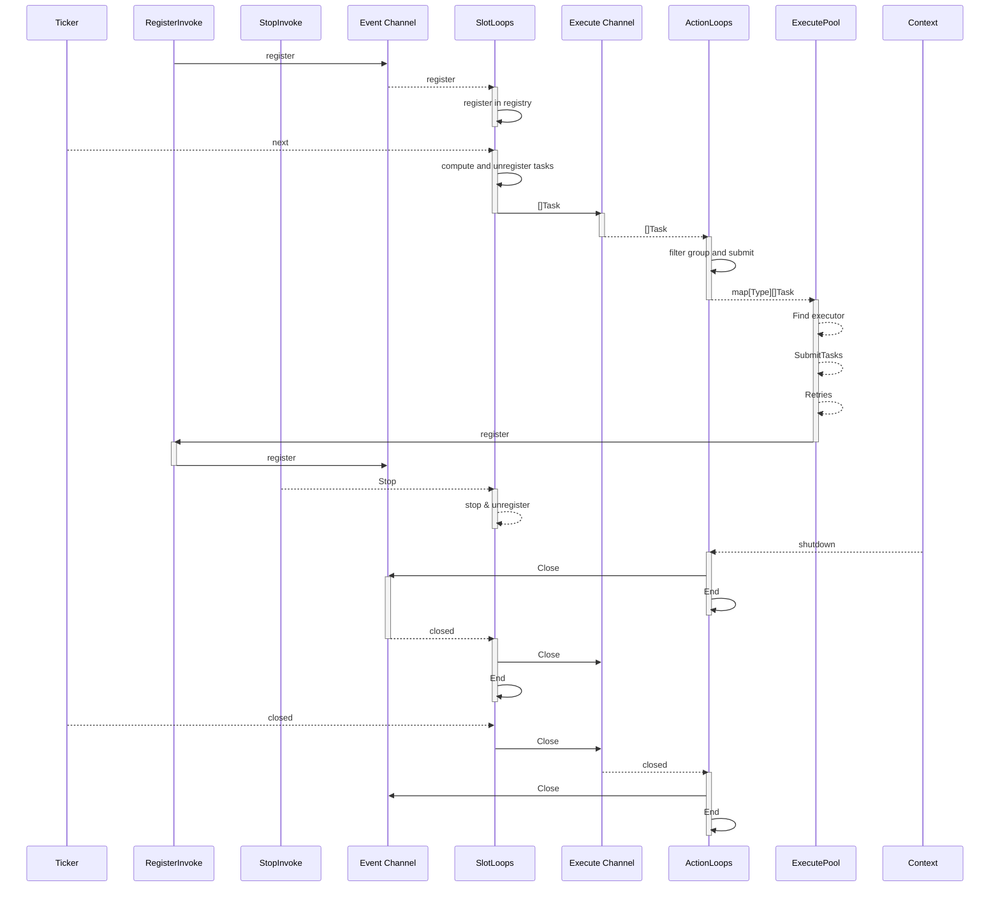

# Ring

## Task status

```mermaid
stateDiagram

Unregistered --> Registered
Registered --> UnregisterExecuting
Registered --> UnregisterStopped
UnregisterStopped-->Unregistered
UnregisterExecuting --> Unregistered
```
## Routines

```mermaid
sequenceDiagram
participant T as Ticker


participant R as RegisterInvoke
participant P as StopInvoke
participant EVT as Event Channel


participant S as SlotLoops
participant EX as Execute Channel
participant A as ActionLoops
participant E as ExecutePool

participant C as Context

R ->> EVT: register
EVT -->>S : register
activate S
S ->>S: register in registry
deactivate  S

T -->> S: next
activate S
S ->> S: compute and unregister tasks
S ->> EX:[]Task
deactivate  S
activate  EX
EX -->>A:[]Task
deactivate  EX
activate A
A ->> A: filter group and submit
A -->> E: map[Type][]Task
deactivate  A

activate E
E -->> E: Find executor
E -->> E: SubmitTasks
E -->> E: Retries
E ->> R: register
deactivate  E
activate  R
R->>EVT:register
deactivate  R

P-->>S: Stop 
activate S
S -->>S: stop & unregister
deactivate  S

C -->> A: shutdown
activate A
A ->> EVT: Close
activate  EVT
A ->> A: End
deactivate  A
EVT -->> S: closed
deactivate  EVT

activate  S
S ->>EX: Close
S ->>S: End
deactivate  S

T -->> S :closed
S ->>EX: Close
EX-->>A: closed
activate  A
A ->> EVT:Close
A ->>A:End
deactivate  A
```